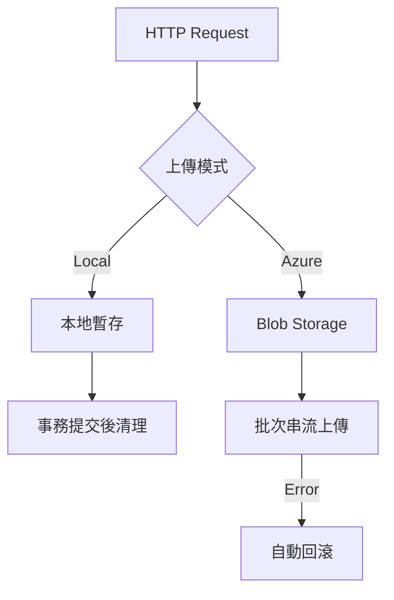

# StreamFileUploadService - 串流檔案上傳服務

## 核心功能

### 🚀 高效能串流處理

- **零緩衝區記憶體消耗** - 直接串流處理避免大檔案記憶體溢位
- **雙模式上傳** - 支援本地儲存與 Azure Blob 無縫整合
- **自動化清理** - 嚴格臨時檔案生命周期管理

### 🔒 可靠性機制

- **事務回滾系統** - Azure 上傳失敗自動清除已傳檔案
- **唯一檔案指紋** - GUID 前綴防範檔案名稱衝突
- **異常隔離處理** - 本地與雲端錯誤處理分離

## 技術架構

